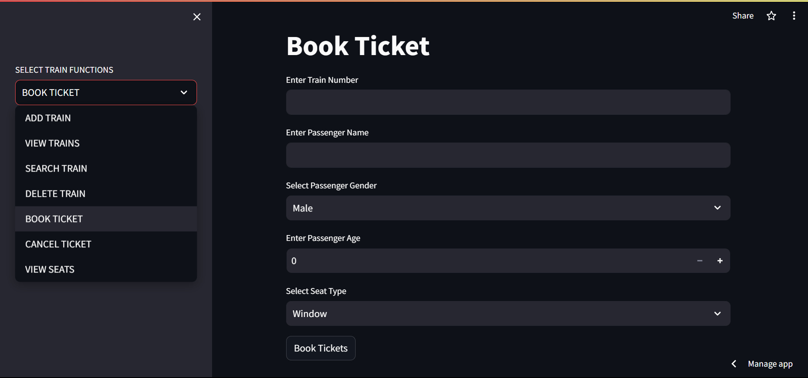

# Railway Reservation System

This project is a Railway Reservation System implemented using PYTHON, STREAMLIT &amp; SQLITE. It provides various functionalities for managing trains, booking and canceling tickets, and viewing seat availability.



## Deployed Link

The Railway Reservation System is deployed using Streamlit. You can access it [here](https://railwayreservationsystem.streamlit.app/).

## Installation

To run this project locally, follow these steps:

1. Clone the repository:

   ```bash
   git clone https://github.com/BKarthik7/RailwayReservationSystem.git
2. Navigate to the project directory:
   ```bash
   cd RailwayReservationSystem
3. Install the required dependencies:
   ```bash
   pip install -r requirements.txt
4. Run the Streamlit app:
   ```bash
   streamlit run app.py

## Technologies Used

- Python
- Streamlit

## Authors

- [@BKarthik](https://github.com/BKarthik7)

Feel free to contribute to this project by opening issues or submitting pull requests.
